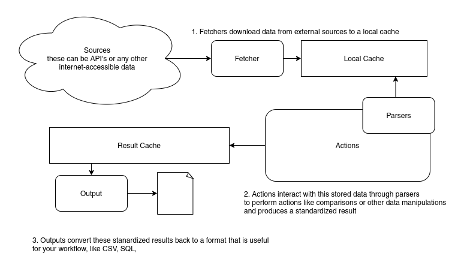

# GeoCompare Structure

GeoCompare is intended to be modular in order to a accomodate multiple different formats (both for input and output) of geographic data

## Fetchers
Fetchers save data from sources like API's to a local cache for processing

## Parsers
Parsers are written to provide a somewhat standard set of methods for accessing data from a particular type of file stored in the cache. This abstracts away the need to handle parsing different formats like GeoJSON in other parts of the program

## Actions
Actions perform the actual operations on the data, such as associating records based on the proximity of their coordinates, or checking which records are contained in another dataset in the cache

## Outputs
Outputs are responsible for taking the results of actions and formatting them in th desired format.  This can be used to export the results in formats like CSV, a database, etc.